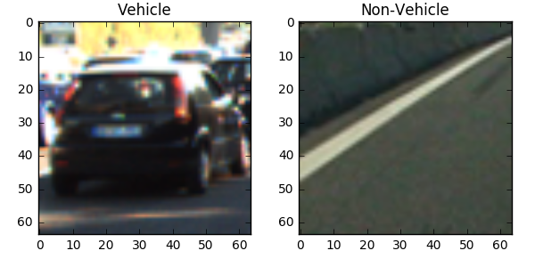
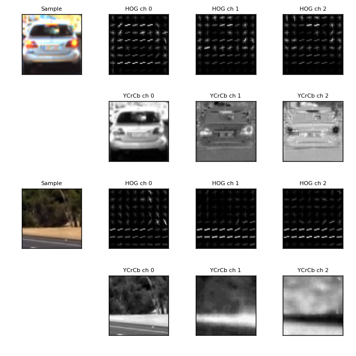

**Vehicle Detection Project**

The goals / steps of this project are the following:

* Perform a Histogram of Oriented Gradients (HOG) feature extraction on a labeled training set of images and train a classifier Linear SVM classifier
* Optionally, you can also apply a color transform and append binned color features, as well as histograms of color, to your HOG feature vector.
* Note: for those first two steps don't forget to normalize your features and randomize a selection for training and testing.
* Implement a sliding-window technique and use your trained classifier to search for vehicles in images.
* Run your pipeline on a video stream (start with the test_video.mp4 and later implement on full project_video.mp4) and create a heat map of recurring detections frame by frame to reject outliers and follow detected vehicles.
* Estimate a bounding box for vehicles detected.

## [Rubric](https://review.udacity.com/#!/rubrics/513/view) Points
###Here I will consider the rubric points individually and describe how I addressed each point in my implementation.  

---
###Writeup / README

####1. Provide a Writeup / README that includes all the rubric points and how you addressed each one.  You can submit your writeup as markdown or pdf.  [Here](https://github.com/udacity/CarND-Vehicle-Detection/blob/master/writeup_template.md) is a template writeup for this project you can use as a guide and a starting point.  

You're reading it!

###Histogram of Oriented Gradients (HOG)

####1. Data Exploration

The first part of this project consist in training a binary classifier capable of identifying vehicles and distinguishing them from non-vehicles. For this classifier I extracted spatial, color and gradient features from a provided dataset of images and evaluated different combination of features and parameters for the classifier.
The dataset of images used to train the classifier is composed by the GTI vehicle image database GTI and the KITTI vision benchmark suite, as well as sample images extracted from the video for this project. All images in the provided dataset are labeled as either `vehicle` and `non-vehicle`. All images are 64x64 pixels as well.

There are 8792 vehicle images and 8968 non vehicle. This difference is minor and both classes can be considered balanced. This is can be considered a good quality of the dataset that helps avoid a bias towards one of the two classes.

Some of the images in the dataset are taken from video sequences, so care must be taken when training the classifier to avoid implicit temporal correlations among images.

I started by reading in all the `vehicle` and `non-vehicle` images. Here is an example of one of each of the `vehicle` and `non-vehicle` classes:

The code for this step is contained in the 1st to 4th, and 8th code cells of the IPython notebook.

In order to train the classifier with these images, we have to select which combination of features will be most useful. I evaluated the performance of the classifier with different combinations of features. This was evaluation was done through a validation set, or samples which the classifier is never training on, to avoid causing ovefitting to the training data. The original dataset was randomly split between a 80% for the training data and a 20% for validation set. This is done in the 9th code cell of the IPython notebook through `scikit-learn`'s `train_test_split()`, which has the added benefit of shuffling the data, so that any order in the images due to the video source is broken.

####2. Explain how (and identify where in your code) you extracted HOG features from the training images.

I explored different color spaces and different `skimage.hog()` and the (`orientations`, `pixels_per_cell`, and `cells_per_block`).  I selected random images from each of the two classes and displayed them to get a feel for what the `skimage.hog()` output looks like.

Here is an example using the `YCrCb` color space and HOG parameters of `orientations=9`, `pixels_per_cell=(8, 8)` and `cells_per_block=(2, 2)`:

The image above is generated in the 7th code cell, which calls  `get_hog_features()` that encapsulates `skimage.hog()` in the 6th code cell, to get the hog features and a visualization

####2. Explain how you settled on your final choice of HOG parameters.

 As mentioned earlier, I explored the performance of a Linear Support Vector Classifier for different color spaces for extracting HOG features. The metrics used to evaluate the performance were the accuracy and F1 score (harmonic mean of Recall and Precision, as we want to minimize false positives and false negatives). While doing this all other parameters were left fixed. This was done in the 10th code cell.

 I determined that the classifier achieved the best performance for the `YCrCb` color space, using all channels to extract HOG features (as I had already determined that reducing the number of channels caused a significant loss in the accuracy).

 I then tested different numbers of orientation bins for HOG features and `orientations=9` was found to perform the best. Larger values did not improve the accuracy and the feature vector became larger. This was done in the 11th code cell. I also selected `pixels_per_cell=(8,8)` as it gave the best performance (intuitively, it is the size that best captures the shape of cars and their main physical features in 64x64 images) and a smaller number would only increase the number of features) Similarly, I got the best results with `cells_per_block=(2,2)`. (1,1) cells per block performed worse and (4,4) dramatically increased the number of features (and thus getting memory errors in my system)

 I also explored, separately from HOG features, the spatial and color features. These features are the binned sample image as an array (spatial features) and the color histogram. The selected spatial size was (32, 32) and the number of bins for the histogram was 32. I evaluate the performance of the classifier for spacial and histogram features in different color spaces, keeping other parameters fixed. Once again `YCrCb` was the winner. This was done in the 12th code cell.

####3. Describe how (and identify where in your code) you trained a classifier using your selected HOG features (and color features if you used them).

I trained a linear SVM, particularly `LinearSVC` from the `scikit-learn` package, using using the combination of the HOG features for all channels of the images in the `YCrCb` color space, with the spatial features and color features for the same color space. The feature vector I settled with has a length of 8460 elements. Most of these feature elements (5292) are HOG features. The rest of the features are spatial features and color features. I selected the size of spatial features to be (32,32) and the number of bins for the histogram 32. This was done in the 15th code cell.
I should note that when combining the HOG features, spatial and color features I noticed that their scales do not match. To avoid that the classifier could give more importance to one feature type over the others, I used a `StandardScaler` object from the `scikit-learn`. This scaler standardizes all features by removing the mean and scaling to unit variance. I fit StandardScaler object using the only the training set, which computes the mean and standard deviation to be used for later scaling any sample that has to be passed to the classifier.
With these features, the classifier achieved an accuracy and F1 score of 0.993.

I used `GridSearchCV` to find the best `C` parrameter for `LinearSVC`.  `C` determines the influence of the misclassification on the objective function. Using this method, I found that a `C=0.01` improves marginally the accuracy and f1 score. This was done in the 16th code cell. The trained classifier and scaler were stored.

I decided to compare different the `LinearSVC` trained as explained above with a `RandomForestClassifier` to check if I could get similar performance from other classification models. This was done in the 17th code cell. The latter model only achieves an accuracy and F1 score of 0.981.

###Sliding Window Search

####1. Describe how (and identify where in your code) you implemented a sliding window search.  How did you decide what scales to search and how much to overlap windows?

Based on the perspective of the scene captured by the camera, I used 5 different sliding windows sizes, each of which is applied to a different image. The sizes of the windows where determined by observing the apparent size of cars at different distances in the provided test images. The position of scanning areas for each window size were determined at first glance with the attempt to match the perspective of the image. The used window sizes are 70, 94, 120, 180, 250. The window sizes and the bounding areas for each size are specified in the 25th code cell.

This search with multiple window sizes is done through the function `find_cars()` in the 24th code cell. For each window size, this function calls `slide_window()` to get all the overlapping windows within the specified bounds and calls `search_windows()` to extract image features for each window, scale them and predict through the classifier whether there is a car in the window or not.

To sum up, I searched on 5 scales, with different bounding area for each scale, using `YCrCb` 3-channel HOG features plus spatially binned color and histograms of color in the feature vector, which provided a nice result.  Here are some example images, along with the drawn sliding windows:

---

### Video Implementation

####1. Provide a link to your final video output.  Your pipeline should perform reasonably well on the entire project video (somewhat wobbly or unstable bounding boxes are ok as long as you are identifying the vehicles most of the time with minimal false positives.)
Here's a [link to my video result](./project_video_out.mp4)

####2. Describe how (and identify where in your code) you implemented some kind of filter for false positives and some method for combining overlapping bounding boxes.

To mitigate and correct for false positives recorded the positions of positive detections in each image.  From the positive detections I created a heatmap and then thresholded that map to identify vehicle positions.  I then used `scipy.ndimage.measurements.label()` to identify individual blobs in the heatmap.  I then assumed each blob corresponded to a vehicle.  I constructed bounding boxes to cover the area of each blob detected.  

Here's an example result showing the heatmap from a series of images, the result of `scipy.ndimage.measurements.label()` and the bounding boxes then overlaid on the last frame of video:

### Here are six images and their corresponding heatmaps:

### Here is the output of `scipy.ndimage.measurements.label()` on the  heatmap from all six images and the resulting bounding boxes:

I defined a class `HeatMapTracker` in the 29th code cell to integrate the heatmaps of each frame to improve detection quality. The aim is to consider as a high confidence detection many positive window detections in the same area in a single frame or many single window detections over multiple frames in the same are as well. `HeatMapTracker` retains a heatmap that it is effectively the result of integrating the heatmaps over multiple frames.

`HeatMapTracker.update()` computes a heatmap from the positive detection windows in each frame, and it is summed to the integrated heatmaps from previous frames. Then, the threshold (a threshold of 5 was selected) is applied to the integrated heatmap (but not stored) and then the blobs are calculated and with `scipy.ndimage.measurements.label()`. The resulting bounding boxes drawn as explained before. In each frame, before summing the current heatmap, 1 is subtracted from every pixel in the integrated heatmap, progressively cooling down the areas where no detection is made. The heatmap is clipped between 0 and 15 to avoid negative values which make no sense, and too large values that would cause that previous hot regions would remain hot too long after no detection is made.

###Discussion

####1. Briefly discuss any problems / issues you faced in your implementation of this project.  Where will your pipeline likely fail?  What could you do to make it more robust?

1- My pipeline is rather slow, at least in my computer, which made it hard and very time consuming to tune parameters, try different searching algorithms or even simple troubleshooting, specially for the video.

2- At the end of the video, a detection of a car in the opposite direction can be seen. I don't know if this can be considered a false positive, but requiring a higher threshold for the heatmap could help in order to remove it.

3- I would like to find a way to differentiate the bounding boxes for multiple cars when they are close to each other. My pipeline is detecting two cars as a large bounding box. Perhaps tracking each bounding box separately and predicting where it will be in the next frame could help, but there might be other solutions that just involve parameter tuning.

4- The performance of the pipeline could be improved by computing the HOG features only once for the entire area of interest, while retaining the approach of scanning it with windows of multiple scales and different area boundaries for each size based on the perspective.

5- Smaller sliding window overlaps would make the search faster, at the expense of some failed detections, but I (probably wrongly) prioritized the quality of the detections over the performance.

6- The sliding window method is expensive. For being able to run it in a real-time application, it has to be optimized, with fewer number of features and/or windows, compensating false positives or momentary loss of detection with better filtering and tracking. Parallel processing is probably also necessary (as the sliding window algorithm is highly parallelizable).

7- It would be a good idea to explore the use of a Convolutional Neural Network for classification or even a Convolutional Encoder-Decoder architecture to perform the image segmentation directly.
